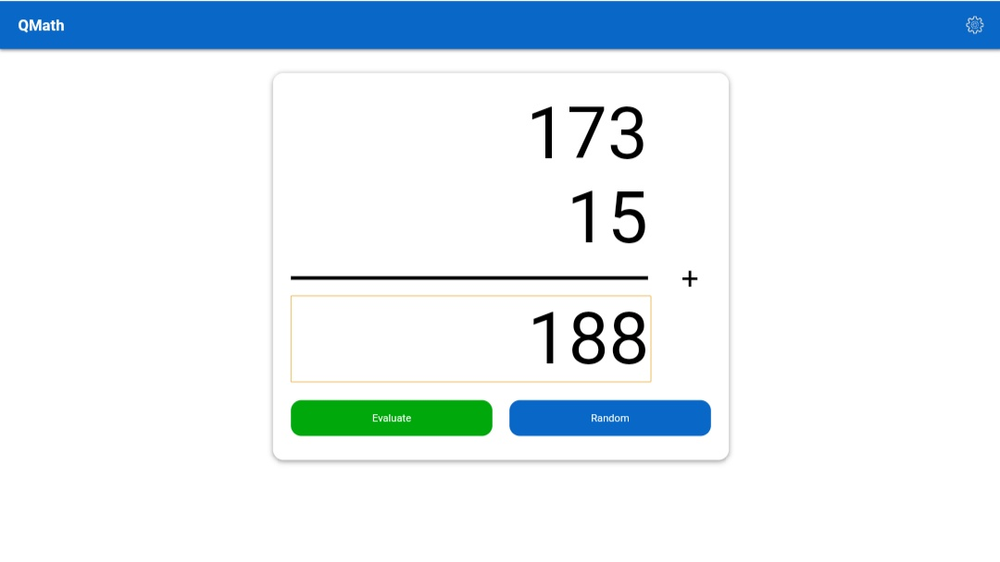
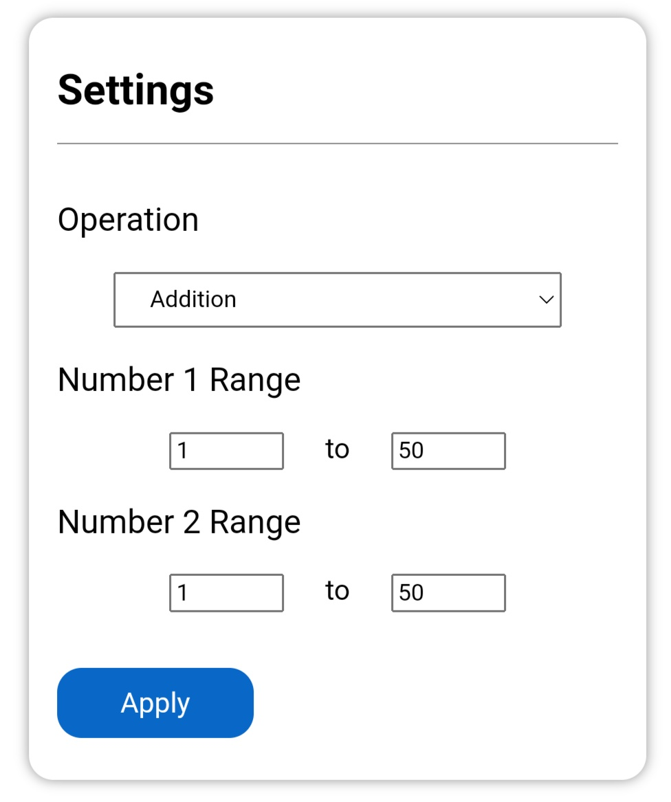

# QMath

[QMath](https://iwanharyatno.github.io/qmath) — A simple front-end website that gives out basic math problem, and you can solve it quick! (well... it's not necessarily to be quick, but it's a good place to practise basic mathematical operations).

# Usage

There is some key components in this app, including.
- Navbar, contains the app title and settings icon.
- Problem Frame, this part contains the math problem (addition, subtraction, multiplication, or division), and of course the answer field right below the separator line.
    - Evaluate Button, check your answer by clicking on this button.
    - Random Button, shuffle the math problem.

# The Settings

You can customize behaviour of the app by adjusting few options in settings. You can open it by clicking on the gear icon on top right of the screen, and you can do the same thing to close the settings dialog. Some options including.
- Operation, select the math operations.
    - :heavy_plus_sign: Addition, Treat operands with addition operation. The result is sum of the top number and the bottom number.
    - :heavy_minus_sign: Subtraction, Treat operands with subtraction operation. The result is the top number minus the bottom number.
    - :heavy_multiplication_x: Multiplication, Treat operands with multiplication operation. The result is the top number times the bottom number.
    - :heavy_division_sign: Division, Treat operands with division operation. The result is the top number divided by the bottom number. And you must at least compute the result with 3 decimal points and round it by 2 decimal points precision (e.g. if the result is 4.666 then the answer is 4.67).
- Number 1 Range, set the range of the top number.
- Number 2 Range, set the range of the bottom number.
- Apply Button, don't forget to apply the modified settings.
